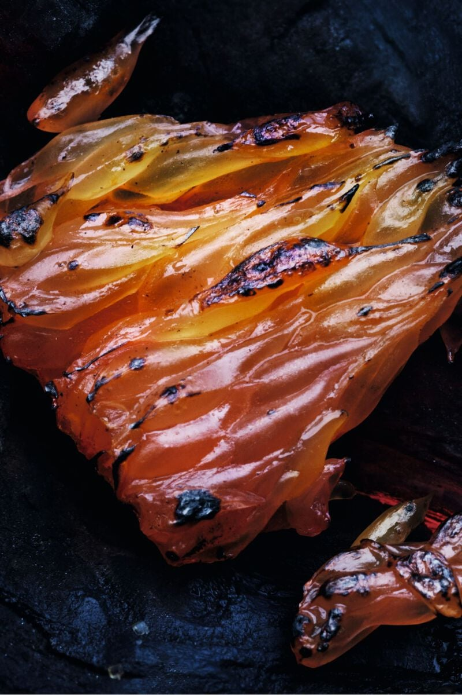
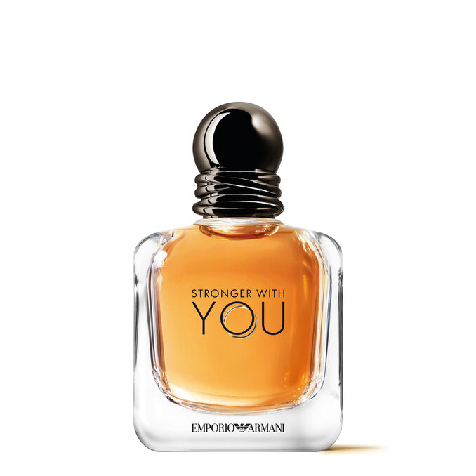
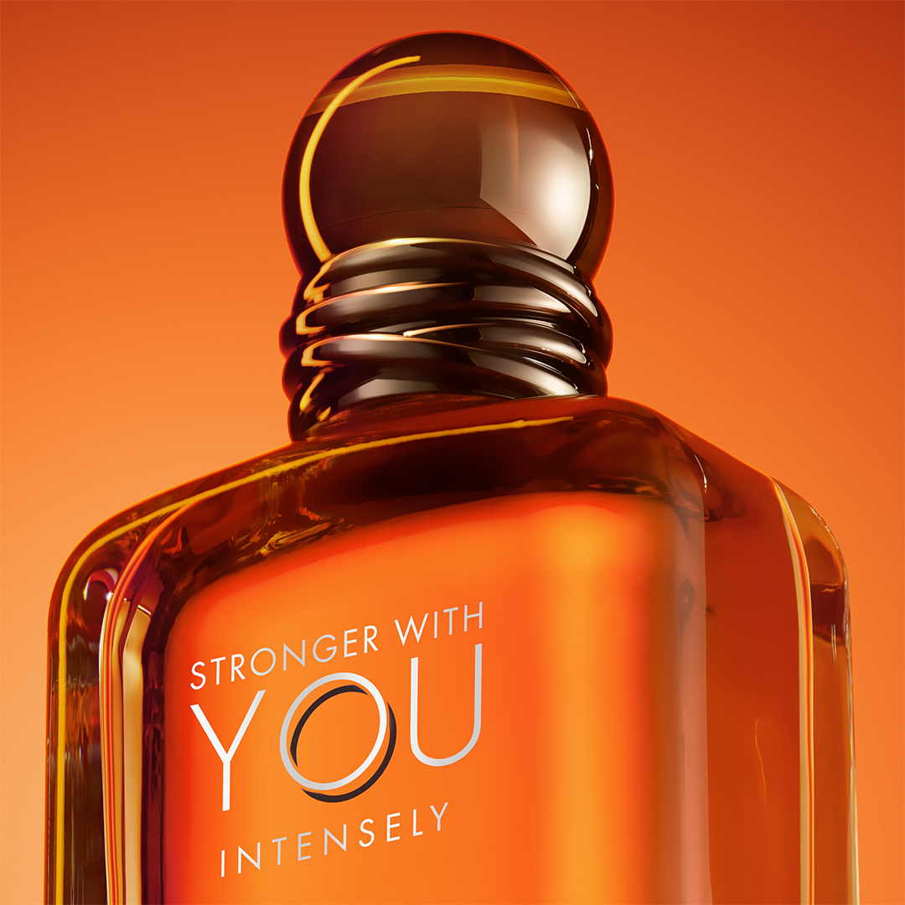
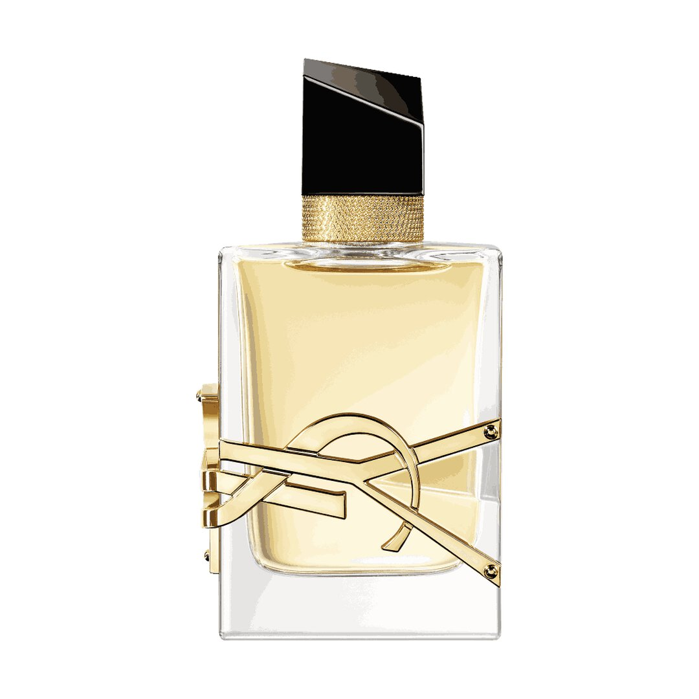
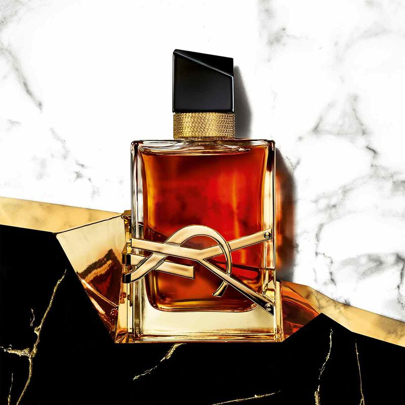
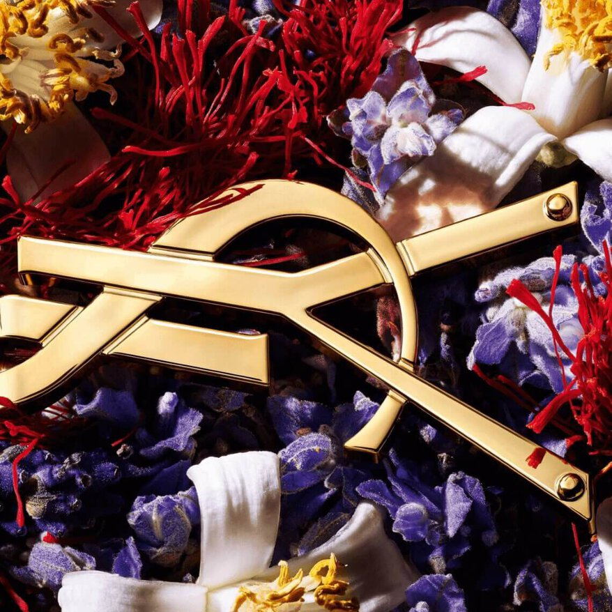
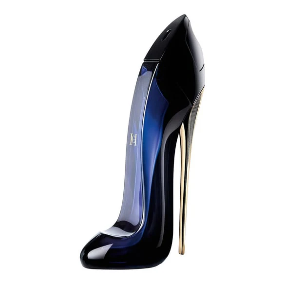

<html lang="fr">
<head>
    <meta charset="UTF-8">
    <meta name="viewport" content="width=device-width, initial-scale=1.0, maximum-scale=1.0, user-scalable=no">
    <title>Velooria Beauty | Collection Privée</title>
    <link href="https://fonts.googleapis.com/css2?family=Cinzel:wght@400;700&family=Montserrat:wght@200;400;600&display=swap" rel="stylesheet">
    
    
</head>
<body>

    
VELOORIA

    

    <section class="product-section sauv-t" id="sec1">
        

        
<video autoplay muted loop playsinline class="bg-v"><source src="assets/sauvage.mp4" type="video/mp4"></video>

        

            
            <h1 class="brand-logo">SAUVAGE ELIXIR</h1>
            
EXTRAIT DE PARFUM

        

        

            

            

                <h3>LA FRAGRANCE</h3>
                
Une concentration inouïe où la fraîcheur emblématique de Sauvage s'enivre d'un cœur d'épices.

                
Caractère : Puissant, Noble et Sauvage 
                Famille : Aromatique Épicé

            

        

        

            

            

                <h3>NOTES OFFICIELLES</h3>
                
Tête : Pamplemousse & Épices (Cannelle, Cardamome) 
                Cœur : Essence de Lavande de Nyons AOP 
                Fond : Bois de Santal & Réglisse

                
Performance : Sillage extrême, tenue +12h.

            

        

        </section>

    <section class="product-section stron-t" id="sec2">
        

        
<video autoplay muted loop playsinline class="bg-v"><source src="assets/stronger.mp4" type="video/mp4"></video>

        

            
            <h1 class="brand-logo">STRONGER WITH YOU</h1>
            
EAU DE PARFUM

        

        

            

            

                <h3>LA FRAGRANCE</h3>
                
Un parfum qui communique avec sensualité. L'alliance d'une vanille fumée et d'un accord marron glacé.

                
Style : Moderne, Magnétique, Chaleureux. 
                Famille : Fougère Oriental.

            

        

        

            

            

                <h3>NOTES OFFICIELLES</h3>
                
Tête : Poivre Rose & Essence de Cardamome 
                Cœur : Sauge Sclarée & Lavande 
                Fond : Vanille & Châtaigne.

            

        

    </section>

    <section class="product-section libre-t" id="sec3">
        

        
<video autoplay muted loop playsinline class="bg-v"><source src="assets/libre.mp4" type="video/mp4"></video>

        

            
            <h1 class="brand-logo">LIBRE INTENSE</h1>
            
EAU DE PARFUM INTENSE

        

        

            

            

                <h3>LA FRAGRANCE</h3>
                
La tension entre la lavande de France et la fleur d'oranger du Maroc poussée à son paroxysme.

                
Tempérament : Royale et Audacieuse 
                Usage : Soirées de Luxe

            

        

        

            

            

                <h3>NOTES OFFICIELLES</h3>
                
Tête : Bergamote & Mandarine 
                Cœur : Fleur d'Oranger & Orchidée Royale 
                Fond : Vanille de Madagascar & Ambre Gris

                
Tenue : Sillage puissant, reste actif jusqu'à 10h.

            

        

    </section>

    <section class="product-section gg-t" id="sec4">
        

        
<video autoplay muted loop playsinline class="bg-v"><source src="assets/goodgirl.mp4" type="video/mp4"></video>

        

            
            <h1 class="brand-logo">GOOD GIRL</h1>
            
EAU DE PARFUM

        

        

            

 

                <h3>LA FRAGRANCE</h3>
                
Un parfum audacieux et sophistiqué, inspiré par la vision unique de la dualité de la femme moderne.

                
Vibe : Séductrice et Puissante 
                Famille : Ambré Floral

            

        

        

            

 

                <h3>NOTES OFFICIELLES</h3>
                
Note de Tête : Amande (Éclat immédiat) 
                Note de Cœur : Jasmin Sambac & Tubéreuse 
                Note de Fond : Fève Tonka & Cacao (Sillage profond)

                
Évolution : Note de fond qui dure jusqu'à 6h sur la peau.

            

        

        

            

                

                    
<h4 style="font-family:'Cinzel'">GOOD GIRL</h4>
10ML / 319 DH

                    
                

                

                    
5ML± 80 RASHAT

                    
10ML± 160 RASHAT

                

            

            
<form><input placeholder="NOM COMPLET"><input placeholder="TÉLÉPHONE"><input placeholder="VILLE"><button type="button" class="order-btn">COMMANDER | 319 DH</button></form>

        

    </section>

    
</body>
</html>
