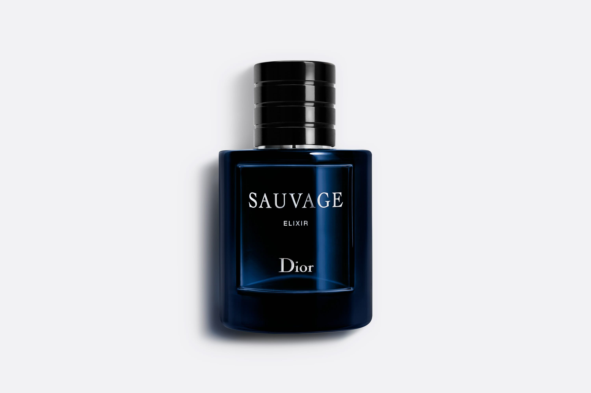

<html lang="fr">
<head>
    <meta charset="UTF-8">
    <meta name="viewport" content="width=device-width, initial-scale=1.0">
    <title>Velooria | Luxury Fragrance</title>
    <link href="https://fonts.googleapis.com/css2?family=Cinzel:wght@700&family=Playfair+Display:ital,wght@0,700;1,400&family=Montserrat:wght@300;400;600&display=swap" rel="stylesheet">
    
    
</head>
<body>

    
VELOORIA

    

        
<video autoplay muted loop playsinline class="bg-v"><source src="sauvage.mp4" type="video/mp4"></video>

        
<h1 class="brand-logo">SAUVAGE</h1>

        

<h3>La fragrance</h3>
Sauvage Elixir est un parfum extraordinairement concentré, infusé de la fraîcheur emblématique de Sauvage. Une composition haute couture.

        
<form class="f-glass"><input type="text" placeholder="Nom Complet" class="in-f" required><input type="tel" placeholder="Numéro de Téléphone" class="in-f" required><button type="submit" class="btn-f">COMMANDER | 319 DH</button>
أولوية المعالجة والشحن تمنح لأسبقية الحجز
</form>

    

    

        
<video autoplay muted loop playsinline class="bg-v"><source src="stronger.mp4" type="video/mp4"></video>

        
<h1 class="brand-logo">STRONGER WITH YOU</h1>

        

<h3>La fragrance</h3>
Un parfum qui vit dans le présent, façonné par l'énergie de la modernité.

        
<form class="f-glass"><input type="text" placeholder="Nom Complet" class="in-f" required><input type="tel" placeholder="Numéro de Téléphone" class="in-f" required><button type="submit" class="btn-f">COMMANDER | 319 DH</button>
أولوية المعالجة والشحن تمنح لأسبقية الحجز
</form>

    

    

        
<video autoplay muted loop playsinline class="bg-v"><source src="libre.mp4" type="video/mp4"></video>

        
<h1 class="brand-logo">LIBRE (EAU DE PARFUM)</h1>

        

<h3>La fragrance</h3>
Libre : la nouvelle Eau de Parfum, le parfum de la liberté.

        
<form class="f-glass"><input type="text" placeholder="Nom Complet" class="in-f" required><input type="tel" placeholder="Numéro de Téléphone" class="in-f" required><button type="submit" class="btn-f">COMMANDER | 319 DH</button>
أولوية المعالجة والشحن تمنح لأسبقية الحجز
</form>

    

    

        
<video autoplay muted loop playsinline class="bg-v"><source src="goodgirl.mp4" type="video/mp4"></video>

        
<h1 class="brand-logo">GOOD GIRL</h1>

        
        

            

            

                

                <h3>La fragrance</h3>
                
La douceur et le pouvoir de séduction du jasmin renforcent encore l’éclat de Good Girl. Le côté mystérieux de Good Girl est révélé grâce au cacao riche en arômes et à l’enivrante fève tonka, tandis que les notes d’amande et de café déposent une touche finale d’éclat mêlé d’audace.

                <ul class="specs-list">
                    <li><b>Pour :</b> Elle</li>
                    <li><b>Elle est :</b> Séductrice et Puissante</li>
                    <li><b>Occasion :</b> Le jour et la nuit</li>
                    <li><b>Famille olfactive :</b> AMBRÉE Ambrée Florale</li>
                    <li><b>La fragrance :</b> Puissante et Provocante</li>
                </ul>
                

                    <h4 style="font-family:'Playfair Display'; color:var(--color);">Le flacon</h4>
                    
Associant l’esthétique de la haute couture à l’expertise technique, l’emblématique talon aiguille Good Girl est à l’image des femmes puissantes.

                

            

        

        

            

            

                

                <h3>Ingrédients Principaux</h3>
                

                    
<b>Famille Olfactive :</b> AMBRÉE Ambrée Florale

                    
<b>Notes de Tête :</b> Amande

                    
<b>Notes de Cœur :</b> Jasmin d’Arabie & Tubéreuse

                    
<b>Notes de Fond :</b> Fève Tonka & Cacao

                

                

                    
* Notes de tête : Première impression d’un parfum (5-15 min).

                    
* Notes de cœur : Dure 20 à 60 minutes environ.

                    
* Notes de fond : Reste le plus longtemps sur la peau (jusqu’à 6 heures).

                

            

        

        
<form class="f-glass"><input type="text" placeholder="Nom Complet" class="in-f" required><input type="tel" placeholder="Numéro de Téléphone" class="in-f" required><button type="submit" class="btn-f">COMMANDER | 319 DH</button>
أولوية المعالجة والشحن تمنح لأسبقية الحجز
</form>

    

</body>
</html>
