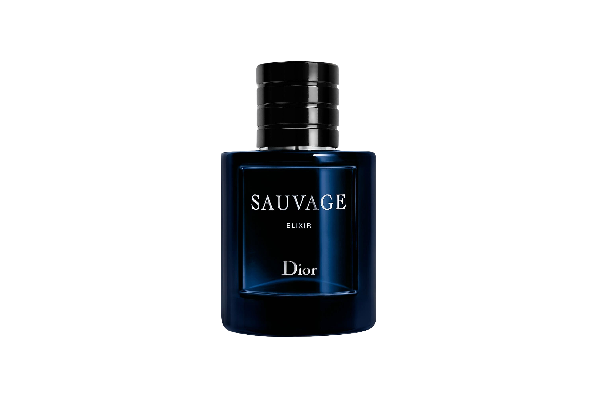

<html lang="en">
<head>
    <meta charset="UTF-8">
    <meta name="viewport" content="width=device-width, initial-scale=1.0, maximum-scale=1.0, user-scalable=no">
    <title>Velooria Beauty | Luxury Perfumes</title>
    <link href="https://fonts.googleapis.com/css2?family=Cinzel:wght@700&family=Playfair+Display:ital,wght@0,700;1,400&family=Montserrat:wght@300;400;600&display=swap" rel="stylesheet">
    
    
</head>
<body>

    
VELOORIA

    

    

        
<video autoplay muted loop playsinline class="bg-v"><source src="assets/sauvage.mp4" type="video/mp4"></video>

        
<h1 class="brand-logo">SAUVAGE</h1>

        

<h3>The Fragrance</h3>
Raw elegance that reveals an authentic man.

        

            

                

<h2>SAUVAGE</h2>
PREMIUM DECANT

                

                    

5ML
~ 75 SPRAYS

                    

10ML
~ 150 SPRAYS

                

            

            

                <form><input type="hidden" id="s1" value="10ml"><input type="text" placeholder="NAME"><input type="tel" placeholder="PHONE"><input type="text" placeholder="CITY"><button class="buy-btn">ORDER NOW | 319 DH</button></form>
            

        

    

    
</body>
</html>
